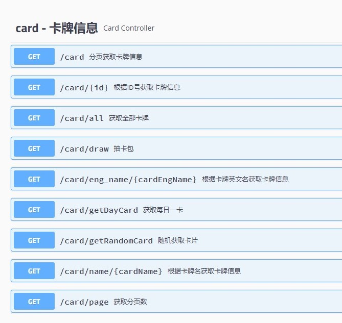
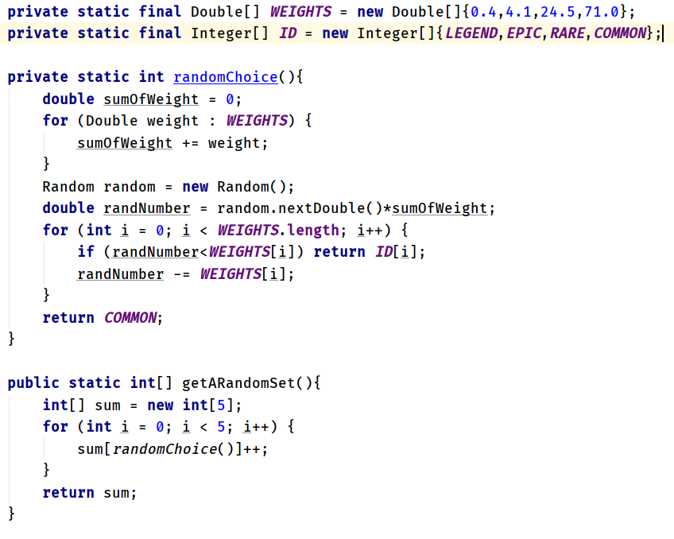
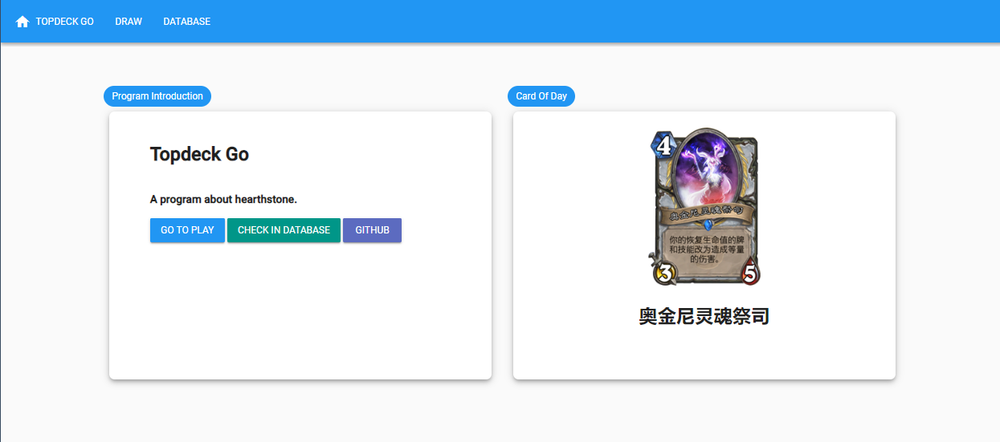
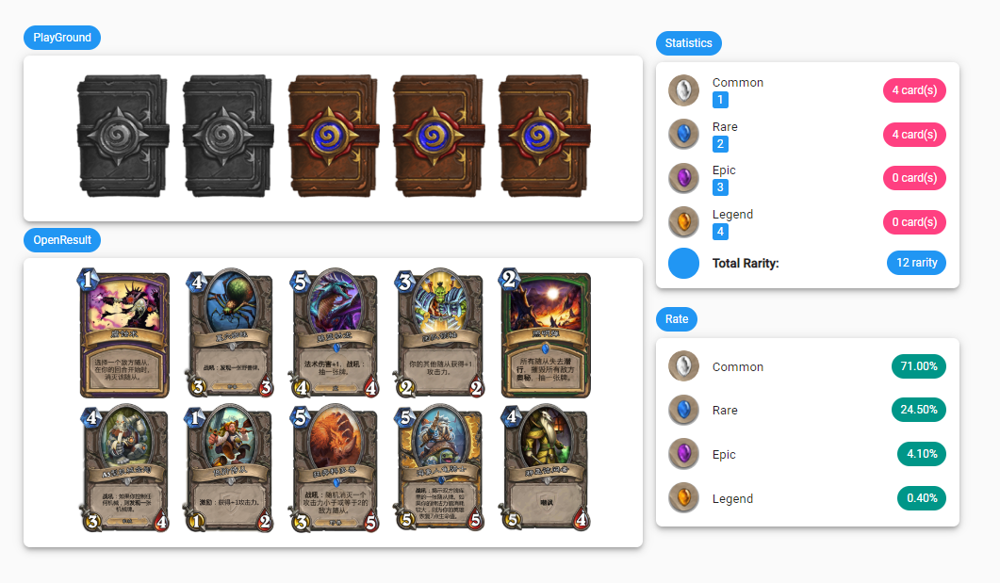
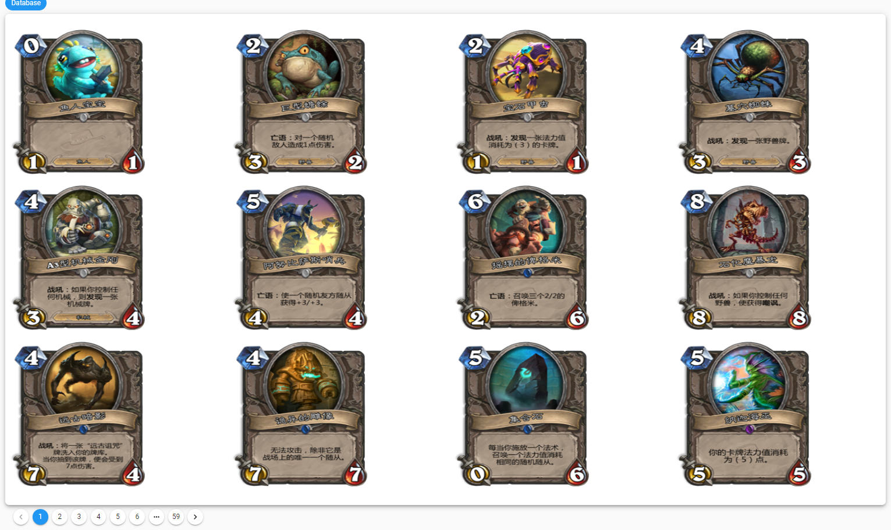
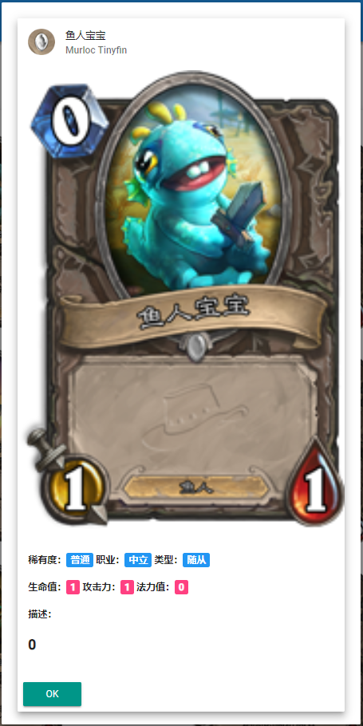

# Topdeck Go
> A program about hearthstone.

> PS:图片数据库已挂

## Quick Start
1. 运行topdeckgo.sql建立数据库
2. 运行topdeckgo.jar
3. 访问http://localhost:8080/topdeck/

## Environment
- JAVA 1.8
- Vue 2.x
- Mysql 5.7 

### Screenshots

## dev
> 项目采用前后端分离，SpringBoot提供API
1. 前端页面放在src\main\resources\static目录下。
    > vue + muse-ui
2. 数据库文件保存在根目录下，文件名为topdeckgo.sql
    > mysql
3. 直接用spring boot内置tomcat服务器启动即可，访问http://localhost:8080/topdeck/
